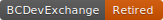

# Assets

## Project State Badges

 A concept or idea that is being explored. In this state, there are no considerations towards IP, money / funding, or licences, and is just an investigation of a topic or idea, often in an open and collaborative way. 

 – Dormant.

 – Something that is in the process of being built, and can be interacted with in some way, though usually in the context of a lab, trial, or test. May have disclaimers regarding use, and may be temporary in nature. 

 – Something that has been built out and in alpha, beta, or production, and can actually be used in some manner. Suggests some level of permanency and support for the product.

 – Retired

